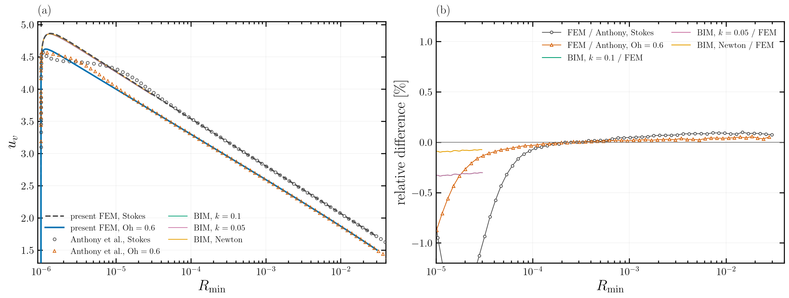
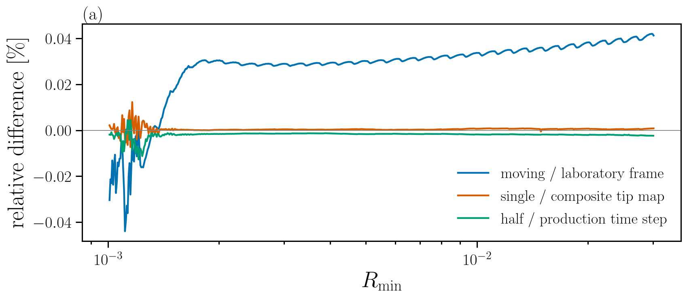
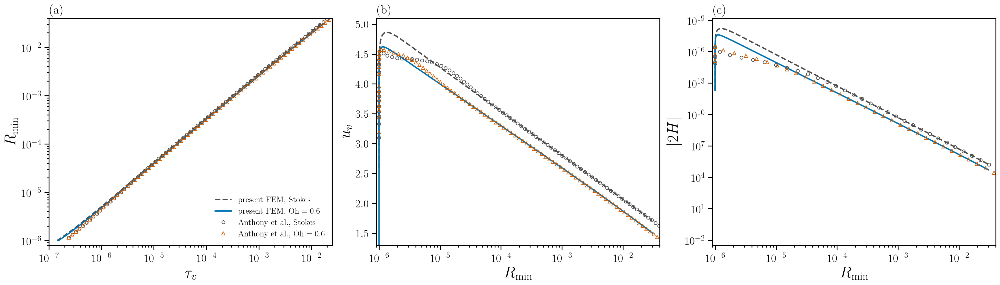
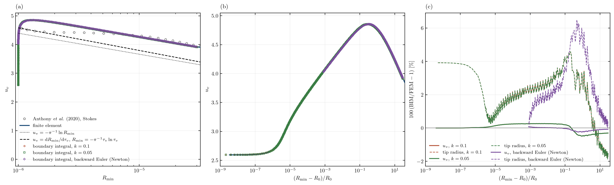
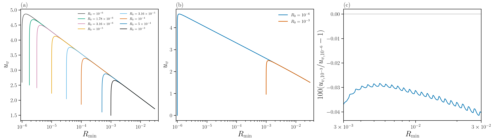
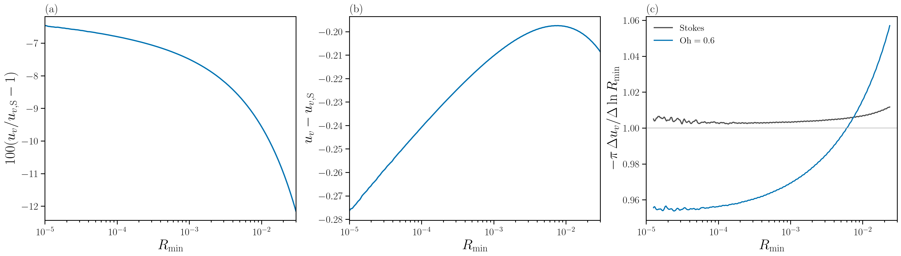

# Finite-Ohnesorge validation at Oh = 0.6

Finite inertia slows the growing neck even when its radius is much smaller
than the Ohnesorge number. At $\mathrm{Oh}=0.6$, our finite-element method
(FEM) agrees with the developed velocity curve of Anthony, Harris & Basaran,
*Physical Review Fluids* **5**, 033608 (2020), Fig. 3, while lying below our
Stokes solution by 6.46% at $R_{\min}=10^{-5}$ and 12.15% at $R_{\min}=0.03$.
We separate this published-data comparison from numerical verification and
convergence.

The [TeX report](finite-oh-validation/main.tex),
[compiled PDF](finite-oh-validation/finite-oh-validation-v4.pdf),
[bibliography](finite-oh-validation/references.bib) and
[reproduction instructions](finite-oh-validation/README.md) accompany this page.

**Figure 1.** Neck velocity in visco-capillary units. Blue: present FEM at
$\mathrm{Oh}=0.6$; dashed grey: present Stokes FEM. Triangles and circles:
Anthony et al.'s finite-Oh and Stokes markers, respectively. The independent
Stokes boundary-integral method (BIM) is shown with two surface gradings and
backward-Euler Newton iteration. Panel (b) shows FEM/Anthony minus one and
BIM/FEM minus one at equal radius, in per cent; its range excludes the early
startup, which is resolved in Figure 4. No marker-fitted offsets are used.
[Vector PDF](figures/public-validation-overview-v4.pdf).

## Problem and units

Two equal drops of radius $R_d$ coalesce in a passive exterior with zero
density and viscosity. The dimensionless bridge radius is $R_0=10^{-6}$ and
its half-height is $Z_0=R_0^2/2$. The initial meridian satisfies
$[r-(R_0+Z_0)]^2+z^2=Z_0^2$, joined tangentially to the spherical drop.
The finite-Oh liquid starts from rest.

Lengths, velocities and times are scaled by $R_d$, $\gamma/\mu$ and
$\mu R_d/\gamma$, respectively. With
$\mathrm{Oh}=\mu/\sqrt{\rho\gamma R_d}$, the inertial coefficient is
$\mathrm{Oh}^{-2}$:

$$
\mathrm{Oh}^{-2}(\partial_t\boldsymbol{u}+\boldsymbol{u}\cdot\nabla\boldsymbol{u})
=\nabla\cdot\boldsymbol{\sigma},\qquad
\nabla\cdot\boldsymbol{u}=0,\qquad
\boldsymbol{\sigma}=-p\boldsymbol{I}+\nabla\boldsymbol{u}+\nabla\boldsymbol{u}^{T}.
$$

The solver time is already visco-capillary. We construct
$\tau_v=t_v+t_{\mathrm{con},v}$ by fitting
$R_{\min}=A(t_v+t_{\mathrm{con},v})^n$ over
$10R_0\leq R_{\min}\leq100R_0$, following the extrapolation procedure in
Anthony et al. The resulting contact shifts are $1.5202\times10^{-7}$ at
$\mathrm{Oh}=0.6$ and $1.4309\times10^{-7}$ in Stokes flow.
There is no additional division by Oh and no offset fitted to the published
markers. These quantities use the existing
[`plot_anthony_fig3.py`](../postProcess/plot_anthony_fig3.py) comparison helpers.

## Verification

The inertial solver recovers the exact linear normal mode of a viscous drop:
frequency errors are $-0.044\%$ and $-0.019\%$ at 200 and 400 steps per
period. At $\mathrm{Oh}=10^{12}$ it reproduces the Stokes steps to
$10^{-14}$ relative. These are tests of the equations and implementation,
not comparisons with Anthony's data; see
[`verificationCases/`](../verificationCases/).

The $\mathrm{Oh}=0.6$, $R_0=10^{-6}$ history reaches
$R_{\min}=0.03037$ in 878 steps and 133 remeshes, with relative volume drift
$2.85\times10^{-7}$.

## Numerical convergence

**Figure 2.** Velocity differences at equal radius for
$\mathrm{Oh}=0.6$, $R_0=10^{-3}$. Blue compares moving and laboratory
frames; orange compares single and composite tip maps; green compares the
half and production time steps using the same single map. The plotted range
begins at $1.01R_0$. No offsets are fitted.
[Vector PDF](figures/finite-oh06-validation-v3-convergence.pdf).

Frame differences remain within about 0.045%. The single-map and
half-time-step comparisons have 95th-percentile absolute differences of
about 0.003%; this is not a uniform maximum-error bound. These completed
checks do not establish full finite-Oh mesh and remeshing convergence:
the bulk-grading 0.07 and remesh-growth 1.05 partners remain outstanding.

## Comparison with Anthony et al.

**Figure 3.** (a) Neck radius against $\tau_v$; (b) neck velocity against
$R_{\min}$; (c) magnitude of twice the mean curvature against $R_{\min}$.
Both FEM curves and both digitised Anthony series are shown, with the same
colour and marker convention as Figure 1. The contact-time construction
affects panel (a) only. No time, radius or velocity offset is fitted to the
published markers.
[Vector PDF](figures/finite-oh06-validation-v3-anthony.pdf).

The table gives **median** differences $100(\mathrm{FEM}/\mathrm{Anthony}-1)$
for the finite-Oh series. Its ranges refer to the published **abscissa**:
$\tau_v$ for radius, $R_{\min}$ for velocity and curvature. Markers outside
the computed coverage are excluded rather than extrapolated.

| Quantity | Abscissa | $10^{-5}$ to $10^{-4}$ | $10^{-4}$ to $10^{-3}$ | $10^{-3}$ to $10^{-2}$ | $10^{-2}$ onward within coverage |
|---|---|---:|---:|---:|---:|
| $R_{\min}(\tau_v)$ | $\tau_v$ | +0.062% | -0.023% | -0.029% | -0.033% |
| $u_v(R_{\min})$ | $R_{\min}$ | -0.133% | +0.005% | +0.028% | +0.044% |
| $\lvert2H\rvert(R_{\min})$ | $R_{\min}$ | +3.19% | -3.50% | -3.04% | -3.37% |

For $R_{\min}\geq10^{-4}$, the finite-Oh velocity errors range from
$-0.027\%$ to $+0.057\%$. Curvature is approximately 3--4% lower there.
The $10^{-5}$ to $10^{-4}$ band still contains a curvature transient:
differences range from $-3.86\%$ to $+73.31\%$.
We do not extend the developed-range agreement to the startup.
The earliest finite-Oh velocity markers differ by up to about 3.8%, and
the radius comparison remains sensitive to the extrapolated contact time.

## Independent Stokes BIM

**Figure 4.** Independent Stokes BIM against the Stokes FEM for the same
$R_0=10^{-6}$ bridge, with Anthony's Stokes markers. The backward-Euler
Newton series differs from the FEM by at most 0.243% over its compared
history; the two linearly implicit grading series differ from the FEM by
at most approximately 0.489%. The two gradings agree much more closely
with each other. Velocity is the discriminating observable; the two
tip-curvature estimators carry approximately 4% estimator uncertainty.
[Vector PDF](figures/stokes-bim-fem-anthony-startup.pdf).

The BIM and FEM independently reproduce the startup peak where Anthony's
Stokes markers differ. The FEM solves for volume velocity and pressure on
an ALE mesh; the BIM solves the Stokes integral equation on a spline
meridian. The solver implementations are independent and use the same
case geometry. We use BIM to name this boundary-integral solver throughout;
there is no additional independent finite-Oh boundary solver in this comparison.
This is code-to-code verification of the Stokes problem, not validation
of finite inertia or a fit to Anthony's startup.

## Initial-radius independence

**Figure 5.** (a) Eight Stokes histories spanning $R_0=10^{-6}$ to
$10^{-3}$; (b) the finite-Oh histories at the two endpoints; (c) their
velocity difference at equal radius. The Stokes curves join the smallest
bridge's curve within 0.1% by approximately $2.3$--$2.7R_0$. At
$\mathrm{Oh}=0.6$, the $R_0=10^{-3}$ and $10^{-6}$ histories differ by at
most 0.042% for $R_{\min}\geq3\times10^{-3}$, with no offsets fitted.
[Vector PDF](figures/finite-oh06-validation-v3-r0.pdf).

The Stokes family is complete. The finite-Oh result is presently a
two-radius check; the intermediate radii $10^{-4}$ and $10^{-5}$ have not
yet been computed.

## Finite inertia relative to Stokes

**Figure 6.** (a) Relative and (b) absolute velocity deficit at equal neck
radius; (c) local logarithmic slopes normalized by $1/\pi$, measured using
secants across 0.2 decades. The grey curve is Stokes and the blue curve is
$\mathrm{Oh}=0.6$.
[Vector PDF](figures/finite-oh06-validation-v3-deficit.pdf).

| $R_{\min}$ | $R_{\min}/\mathrm{Oh}$ | $u_v-u_{v,\mathrm{S}}$ | Relative difference |
|---:|---:|---:|---:|
| $10^{-5}$ | $1.67\times10^{-5}$ | -0.2765 | -6.46% |
| $10^{-4}$ | $1.67\times10^{-4}$ | -0.2408 | -6.80% |
| $10^{-3}$ | $1.67\times10^{-3}$ | -0.2103 | -7.49% |
| $10^{-2}$ | $1.67\times10^{-2}$ | -0.1979 | -9.56% |
| $0.03$ | $0.05$ | -0.2086 | -12.15% |

The absolute deficit varies between about $-0.28$ and $-0.20$ over this
range. Its relative magnitude grows as the Stokes velocity falls. Writing
$u_v=\pi^{-1}\ln(C/R_{\min})$ defines a diagnostic
$C_{\mathrm{eff}}=R_{\min}\exp(\pi u_v)$. The inferred finite-Oh/Stokes
ratio is 0.4196 at $R_{\min}=10^{-5}$, 0.5371 at $10^{-2}$ and 0.5193 at
$0.03$. The value 0.444 is the first-decade median, not the value at
$10^{-5}$.

A changed outer cut-off of the Stokes logarithm is a plausible
interpretation, not an established mechanism. The normalized finite-Oh
slope has decade medians of approximately 0.955, 0.961 and 0.985 between
$10^{-5}$ and $10^{-2}$.
Since this run reaches only $R_{\min}/\mathrm{Oh}=0.05$, it does not test
the expected crossover at $R_c\approx\mathrm{Oh}$. An Oh ladder reaching
that scale is needed to distinguish the cut-off hypothesis from other
finite-inertia corrections.

## Reproduction

The [report build](finite-oh-validation/README.md) uses compact,
checksum-verified inputs and writes every render under a new prefix.
[`plot_finite_oh_validation.py`](../postProcess/plot_finite_oh_validation.py)
rebuilds Figures 2, 3, 5 and 6;
[`plot_public_validation.py`](../postProcess/plot_public_validation.py)
rebuilds Figure 1. Both also accept `--archive` to use the registered raw
histories through the existing `data-roots.toml` mechanism.
The BIM figure's source is
[`plot_bim_vs_fem.py`](../postProcess/plot_bim_vs_fem.py), with its registered
inputs in [`verificationCases/bim-vs-fem-stokes-startup/`](../verificationCases/bim-vs-fem-stokes-startup/).

The original finite-Oh comparison is retained unchanged as
[PNG](figures/finite-oh06-anthony-comparison.png) and
[PDF](figures/finite-oh06-anthony-comparison.pdf).
