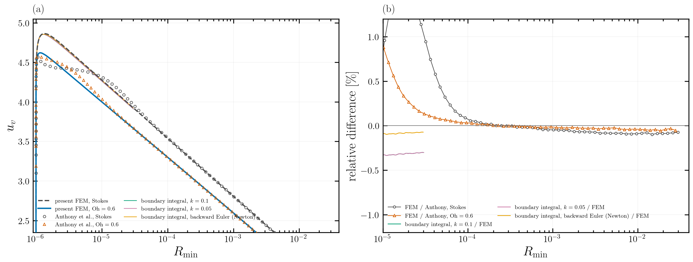
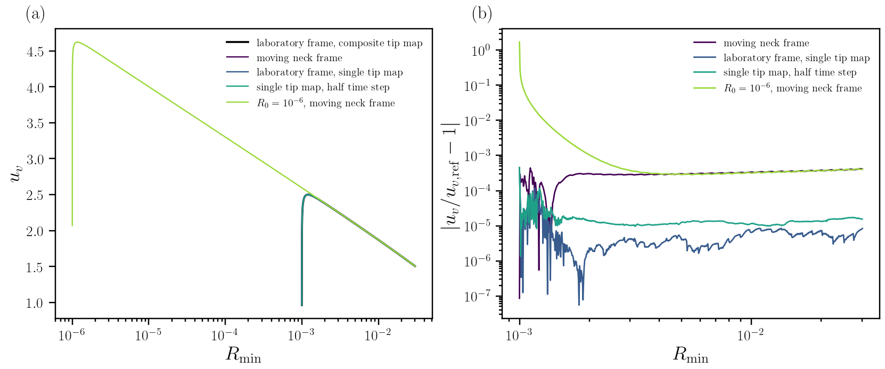
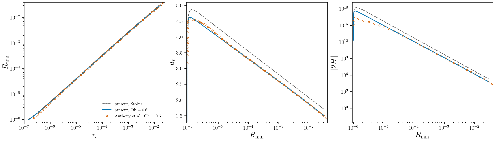

# Finite-Ohnesorge validation at Oh = 0.6

This page records the first finite-inertia validation of the tip-graded
finite-element solver. We compare the present axisymmetric FEM computation with
the digitised markers of Anthony, Harris & Basaran, *Phys. Rev. Fluids* **5**,
033608 (2020), Fig. 3, and test the disputed Stokes startup against an
independent boundary-integral method (BIM). The BIM is a boundary-integral
solver, not a boundary-element method (BEM).

The headline result is simple: at `Oh = 0.6`, the FEM reproduces Anthony's
published finite-Oh curve in the developed range, while finite inertia lowers
the neck velocity relative to the Stokes limit by about 6.5% at
`R_min = 10^-5` and 12.2% at `R_min = 0.03`. The reduction is a physical
finite-Oh effect in the present start-from-rest problem, not a mesh or time-step
error at the level tested here.



**Figure 1.** Present FEM and independent BIM neck velocities against neck
radius. Grey circles and orange triangles are the digitised Stokes and
`Oh = 0.6` markers of Anthony et al. (2020). The residual panel shows the
pointwise comparisons without fitted offsets. The green, pink and yellow curves
are independent BIM calculations with two tip gradings and a backward-Euler
Newton continuation. The vector figure is
[`figures/public-validation-overview.pdf`](figures/public-validation-overview.pdf).

## Units and comparison protocol

The solver uses visco-capillary units throughout: lengths are scaled by the
drop radius `R`, velocities by `gamma/mu`, and time by `mu R/gamma`. In these
units the inertial coefficient is `Oh^{-2}`. The case-file prose inherited an
older inertial-capillary description; the run manifest and the plotted
quantities are the authoritative units for this comparison.

We construct the paper's time variable as

```text
tau_v = t_v + t_con,v,
```

where `t_con,v` is obtained from the same power-law extrapolation used by
`postProcess/plot_anthony_fig3.py`, fitted over `10 R0 <= R_min <= 100 R0`.
The shifts are `1.5202 x 10^-7` for `Oh = 0.6` and `1.4309 x 10^-7` for the
Stokes reference. We do not fit a time, radius or velocity offset to Anthony's
markers.

The production finite-Oh case is
[`T5-Oh0.6-R0-1e-06.json`](../simulationCases/anthony2020/T5-Oh0.6-R0-1e-06.json),
with `R0 = 10^-6`, `Z0 = R0^2/2`, and `Oh = 0.6`. Its registered run identity
and checksum are listed in
[`validationCases/anthony2020-fig3-oh06/runs.toml`](../validationCases/anthony2020-fig3-oh06/runs.toml).

## Verification and convergence

We keep numerical verification separate from comparison with the published
markers.

The finite-Oh reference reaches `R_min = 0.03037` in 878 steps and 133
remeshes. The relative volume drift is `2.85 x 10^-7`. At `R0 = 10^-3`, the
laboratory-frame and moving-neck-frame histories differ by at most about 0.04%
in the developed range. The production tip-map and half-time-step partners
remain within 0.003% in the same range. The `R0 = 10^-6` and `R0 = 10^-3`
histories join to within 0.04% once `R_min >= 3 x 10^-3`.



**Figure 2.** Neck-velocity ratios for the frame, tip-map, time-step and initial
radius partners at `Oh = 0.6`. The curves are compared at equal `R_min`; no
offsets are fitted. Vector figure:
[`figures/finite-oh06-convergence.pdf`](figures/finite-oh06-convergence.pdf).

The normal-mode test of the inertial solver gives a frequency error of
`-0.044%` at 200 steps per period and `-0.019%` at 400 steps per period. The
large-Oh limit is also recovered: `Oh = 10^12` reproduces the Stokes steps to
`10^-14`, while the finite departure at `Oh = 440` is time-step converged. These
tests are documented in
[`verificationCases/`](../verificationCases/).

## FEM against Anthony et al.



**Figure 3.** Present FEM against the digitised Stokes and `Oh = 0.6` series of
Anthony et al. (2020), using the paper's `tau_v` construction and no fitted
offsets. The developed finite-Oh velocity agrees with the published markers to
better than 0.1% in the reported bands. The curvature is about 3--4% lower in
the developed range; the first points are dominated by the same sharp startup
and tip-curvature sensitivity already identified in the Stokes record. Vector
figure:
[`figures/finite-oh06-anthony-comparison.pdf`](figures/finite-oh06-anthony-comparison.pdf).

The comparison statistics are:

| observable | `10^-5 <= R_min < 10^-4` | `10^-4 <= R_min < 10^-3` | `10^-3 <= R_min <= 0.03` |
|---|---:|---:|---:|
| `R_min(tau_v)` relative difference | `+0.06%` | `-0.02%` | `-0.03%` |
| `u_v(R_min)` relative difference | `-0.13%` | `+0.005%` | `+0.04%` |
| `|2H|(R_min)` relative difference | approximately `-3%` to `-4%` in the developed range | approximately `-3%` to `-4%` | approximately `-3%` to `-4%` |

The earliest published Stokes markers and the present Stokes startup do not
coincide. We do not use the finite-Oh comparison to reopen that already closed
question; the independent BIM test below addresses whether the present FEM
startup is reproducible for the same equations and initial geometry.

## Independent Stokes BIM check


**Figure 4.** Independent axisymmetric BIM calculations against the present
Stokes FEM for the exact `R0 = 10^-6` bridge. The backward-Euler Newton series,
which removes the linearisation error of the linearly implicit BIM step, differs
from the FEM by at most 0.243% over the compared history. The two grading
partners differ by about 0.489% at worst. The BIM follows the FEM through the
startup where Anthony's Stokes markers differ. Vector figure:
[`figures/stokes-bim-fem-anthony-startup.pdf`](figures/stokes-bim-fem-anthony-startup.pdf).

The two solvers share only the case file. The FEM resolves the volume and
pressure fields on a tip-graded ALE mesh; the BIM solves the Stokes free-surface
integral equation on an independently represented meridian. Agreement between
these formulations is therefore a code-to-code verification of the present
startup, not a second fit to the published curve. The full run list is in
[`verificationCases/bim-vs-fem-stokes-startup/`](../verificationCases/bim-vs-fem-stokes-startup/).

## What small inertia does

At equal `R_min`, finite inertia reduces the neck velocity relative to the
Stokes reference as follows:

| `R_min` | `R_min/Oh` | `u_v - u_v,Stokes` | relative difference |
|---:|---:|---:|---:|
| `10^-5` | `1.67 x 10^-5` | `-0.2765` | `-6.46%` |
| `10^-4` | `1.67 x 10^-4` | `-0.2408` | `-6.80%` |
| `10^-3` | `1.67 x 10^-3` | `-0.2103` | `-7.49%` |
| `10^-2` | `1.67 x 10^-2` | `-0.1979` | `-9.56%` |
| `0.03` | `0.05` | `-0.2086` | `-12.15%` |

The absolute deficit is nearly constant, about `-0.2` to `-0.28`, while the
relative deficit grows because the Stokes logarithm decreases with `R_min`.
Writing the Stokes law as `u_v = -(1/pi) ln(R_min/C)` gives an effective
cut-off ratio `C_finite-Oh/C_Stokes` of about 0.44 at `R_min = 10^-5` and 0.53
by `R_min = 10^-2--0.03`. The local logarithmic slope is also slightly smaller
than the Stokes value, about 0.955--0.985 of `1/pi` between `10^-5` and
`10^-2`.

This makes a changed outer cut-off of the Stokes logarithm a plausible mechanism,
but not a complete explanation: the data show both a cut-off/prefactor change
and a weak slope change. The present run only reaches `R_min/Oh = 0.05`, well
below the expected Stokes-to-inviscid crossover `R_c approximately Oh`. An Oh
ladder extended to `R_min` of order `Oh` is therefore required before we can
claim a crossover mechanism.

## Reproduction

Rebuild the overview from the registered FEM, BIM and digitised data with:

```bash
python postProcess/plot_public_validation.py \
  --out <new-output-prefix>
```

The comparison and convergence figures are rebuilt by the scripts named in the
corresponding evidence folders. The PDF figures in `docs/figures/` use embedded
Computer Modern fonts and are ready for inclusion from TeX with, for example:

```tex
\begin{figure}
  \centering
  \includegraphics[width=\linewidth]{figures/public-validation-overview.pdf}
  \caption{Finite-Oh FEM, Stokes FEM, Anthony et al. markers and independent BIM.}
\end{figure}
```

The public validation case is
[`validationCases/anthony2020-fig3-oh06/README.md`](../validationCases/anthony2020-fig3-oh06/README.md).
The Stokes limiting case remains documented in
[`docs/la0-stokes-anthony-fig3.md`](la0-stokes-anthony-fig3.md).

## Scope of the result

This page establishes the `Oh = 0.6`, `R0 = 10^-6` comparison and the
independent Stokes startup check. It does not claim that the `Oh` ladder or the
`R_c approximately Oh` crossover has been completed. Those are the next
discriminating calculations, after the exact case list and compute capacity have
been confirmed.
