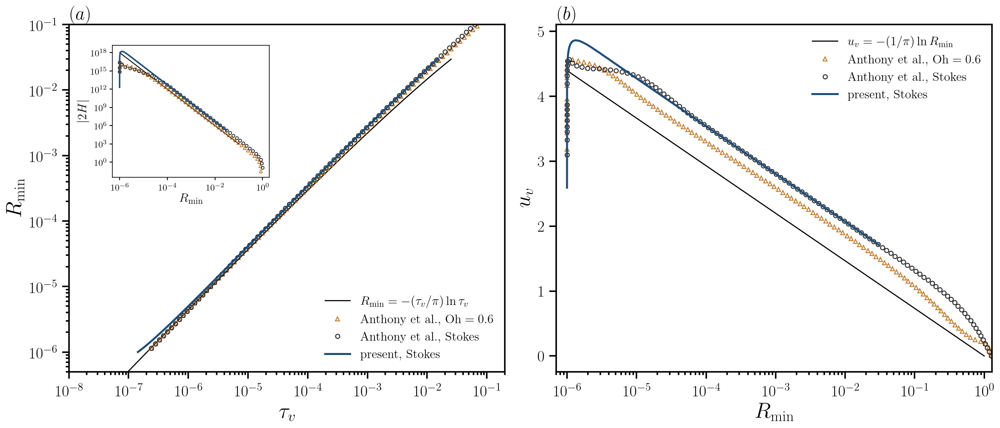
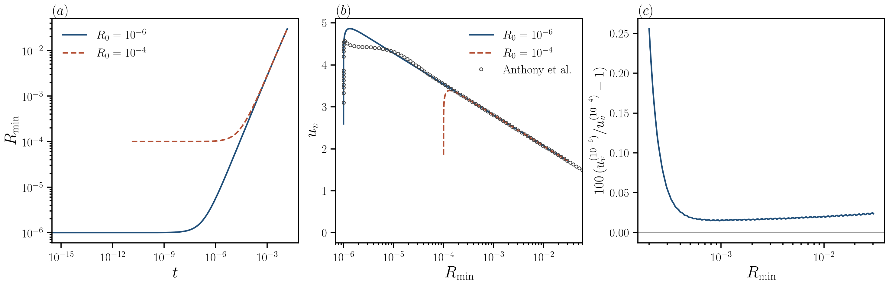

# Stokes coalescence from the exact Anthony bridge: reproduction of Figure 3

This note documents the Stokes-limit (La = 0, 1/Oh = 0) reproduction of
Figure 3 of Anthony, Harris & Basaran, *Phys. Rev. Fluids* **5**, 033608
(2020), starting from their exact initial bridge, and the numerical method
that makes the computation possible. The corresponding finite-Ohnesorge
comparison at Oh = 0.6, including the independent BIM startup check, is now
documented in [Finite-Ohnesorge validation at Oh = 0.6](finite-oh-validation.md).



**Figure 1.** (a) Minimum neck radius against the coalescence time
τ_v = t + t_con, with twice the mean curvature at the neck in the inset;
(b) neck velocity against neck radius. Solid blue: present Stokes
computation from R0 = 10⁻⁶, Z0 = 5 × 10⁻¹³. Circles and triangles: the
Stokes and Oh = 0.6 markers of the published figure, extracted from the
vector graphics of the article. Black lines: the Stokes-theory curves drawn
in the published figure, R_min = −(τ_v/π) ln τ_v, u_v = −(1/π) ln R_min and
|2H| = R_min⁻³. Vector version:
[`figures/anthony-fig3-reproduction-stokes.pdf`](figures/anthony-fig3-reproduction-stokes.pdf).

## Problem

Two equal drops of radius R in a passive exterior (zero density, zero
viscosity, constant pressure) are joined by a bridge of radius R0 and half
height Z0, whose surface is the torus [r − (R0 + Z0)]² + z² = Z0²
(Eq. 2 of the paper). Point contact is approximated by Z0 = R0²/2. Lengths are
scaled by R, velocities by the visco-capillary velocity γ/μ and times by
μR/γ, so that u_v and τ_v are the paper's visco-capillary quantities. In the
Stokes limit the liquid obeys

∇·**σ** = 0, ∇·**u** = 0, **σ** = −p**I** + (∇**u** + ∇**u**ᵀ),

with the free-surface conditions **n**·**σ** = −κ**n** and
(ẋ_s − **u**)·**n** = 0 on the interface. By symmetry one quadrant of one drop
is computed (axis r = 0, symmetry plane z = 0). The case file is
[`simulationCases/anthony2020/T5-stokes-R0-1e-06.json`](../simulationCases/anthony2020/T5-stokes-R0-1e-06.json).

The computation is multiscale in the extreme: the neck radius starts at
10⁻⁶, the initial meniscus radius of curvature is Z0 = 5 × 10⁻¹³, and the
meniscus sharpens to a radius of order 10⁻¹⁹ early in the transient before it
grows again as about 0.2 R_min³.

## Method

- **Discretisation.** Taylor–Hood triangles (quadratic velocity and geometry,
  linear pressure), an arbitrary Lagrangian–Eulerian mesh moved by Laplace
  smoothing, the kinematic condition imposed through a Lagrange multiplier,
  and second-order backward differentiation in time with Newton iteration.
  The solver is pyoomph, pinned to an exact commit.
- **Tip-magnifying mesh.** Each mesh is generated in stretched coordinates
  about the neck tip T, x′ = T + (x − T)(d′/d) with d = |x − T|, and mapped
  back node by node. The radial map is linear inside one lagged tip radius,
  follows d′ ∝ d^{1/2} out to 10³ tip radii (so that the mapped tip is an exact
  parabola) and d′ ∝ d^{0.4} beyond. This keeps the ratio of the domain to the
  smallest mapped element within the range a Delaunay mesher can honour while
  the physical tip elements reach 10⁻²¹. The mesh is graded as
  h′ = k d′ in the mapped plane, with a finer grading on the interface.
- **Neck-anchored moving frame.** The radial mesh coordinate is measured from
  the neck, r = X + R_neck(t), with R_neck a global unknown solved within each
  time step and the kinematic condition corrected by dR_neck/dt n_r. Near the
  tip, nodal coordinates then carry round-off relative to the tip radius
  rather than to the neck radius, and the apex does not translate relative to
  its elements. Only the 2πr measure, hoop terms and the axis condition
  (r = 0 ⇔ X = −R_neck) depend on the shift.
- **Remeshing.** A new mesh is built when the tip radius changes by a set
  factor, when R_min has grown by 10%, or when element quality degrades. Because
  inertia is absent, the interface is the complete state: the new mesh is built
  on the old discrete interface, the velocity is solved again, and the time
  integrator restarts. The same mechanism restarts a computation from any saved
  remesh state.
- **Neck-zone refinement.** The startup transient is sensitive to the
  resolution of the flow within about 2 R_min of the tip. The production
  mesh uses a grading of 0.05 between 10⁻³ R_min and 2 R_min from the tip,
  0.1 elsewhere in the bulk and 0.035 on the interface.
- **Time step.** The step is limited by 2% of R_min/u_v and by a 5% relative
  change of the tip curvature per step.

The exact runner arguments are listed under [Reproduction](#reproduction).

## Verification

All differences below are between complete computations with no fitted
offsets.

- **Spatial convergence in the startup transient.** Restarts from a common
  state at R_min = 1.35 × 10⁻⁶ with bulk gradings 0.1, 0.07 and 0.05 give
  smoothed u_v(1.5 × 10⁻⁶) = 4.961, 4.906 and 4.897: successive differences of
  0.055 and 0.009, so the finest mesh is within about 0.03% of the
  extrapolated limit. The neck-zone refinement reproduces the uniformly
  refined 0.05 mesh within 0.1% at half the number of unknowns. At
  R_min ≈ 1.04–1.06 × 10⁻⁶, bulk gradings 0.1 and 0.07 differ by 0.15–0.3%.
  Tip resolution (16 or 32 elements per tip radius), the time-step criterion
  and interface refinement change u_v by less than 0.3% in these windows.
- **Absence of numerical oscillation.** With a uniform bulk grading of 0.1 and
  remeshing only after 50% growth of R_min, u_v oscillated between remeshes
  for 1.3 × 10⁻⁶ < R_min < 2 × 10⁻⁵ (peak-to-peak 0.12) and dropped by
  1.2–1.5% at each remesh. The oscillation was traced to under-resolved bulk
  flow near the neck and to deformation of the moving mesh between remeshes.
  With the neck-zone refinement and remeshing every 10% of growth, the residual
  of u_v about a smooth fit in ln R_min over 1.4–3 × 10⁻⁶ is 7 × 10⁻⁴ RMS and
  3 × 10⁻³ peak to peak.
- **Mass conservation.** The drop volume changes by less than 10⁻⁶ relative
  over the whole computation.
- **Initial-radius independence.** For the R0 = 10⁻³, 5 × 10⁻⁴ and 10⁻⁴
  computations at a uniform grading of 0.2, u_v agrees to better than 0.05%
  wherever the trajectories overlap. With the same resolution settings (bulk
  grading 0.1, neck-zone grading 0.05, interface grading 0.035, remeshing
  every 10% of growth; the R0 = 10⁻⁴ case keeps the laboratory frame and a
  single map exponent of 0.6, which suffice at that radius), the R0 = 10⁻⁶
  and R0 = 10⁻⁴ trajectories differ by 0.26%
  at R_min = 2 × 10⁻⁴, where the R0 = 10⁻⁴ start is still relaxing, and by
  +0.015 to +0.024% from R_min = 5 × 10⁻⁴ to 0.03 (median +0.019% and
  95th percentile 0.095% over 2 × 10⁻⁴ ≤ R_min ≤ 0.03; Figure 2). At a given
  radius the R0 = 10⁻⁶ computation is later by 2.5–2.7 × 10⁻⁵, the time it
  spends reaching R_min = 10⁻⁴, and this offset is nearly constant.



**Figure 2.** (a) R_min(t) from R0 = 10⁻⁶ and R0 = 10⁻⁴ with the same
resolution settings, each from its own t = 0; (b) u_v(R_min) with the published Stokes
markers; (c) relative difference in u_v over the shared range. No offsets
are fitted. Vector version:
[`figures/initial-radius-independence-stokes.pdf`](figures/initial-radius-independence-stokes.pdf).

## Comparison with the published figure

Relative difference of the present computation from the published Stokes
markers, (present/published − 1):

| quantity (range of the published abscissa) | early | intermediate | self-similar |
|---|---|---|---|
| u_v, by R_min | < 2 × 10⁻⁶: median +2.8% (−2.2 to +8.7%); 2 × 10⁻⁶–10⁻⁵: median +2.8% | 10⁻⁵–10⁻⁴: median −0.9% (−1.6 to −0.1%) | 10⁻⁴–10⁻³: −0.06 to +0.05%; ≥ 10⁻³: +0.05 to +0.10% |
| \|2H\|, by R_min | < 2 × 10⁻⁶: 1.7× to about 200× larger | 10⁻⁵–10⁻⁴: +7 to +420% | 10⁻⁴–10⁻³: −3.3 to +0.4%; ≥ 10⁻³: −2.7 to −1.9% |
| R_min, by τ_v | < 10⁻⁶: +14 to +27%; 10⁻⁶–10⁻⁵: +2.0 to +13% | 10⁻⁵–10⁻⁴: +0.2 to +1.6% | 10⁻⁴–10⁻³: −0.04 to +0.12%; ≥ 10⁻³: −0.04 to +0.07% |

- **Self-similar regime.** For R_min ≥ 10⁻⁴ the neck velocity agrees with the
  published Stokes curve to within 0.1% and follows the slope −1/π; the neck
  curvature agrees to within 3% and settles at |2H| R_min³ ≈ 4.9.
- **Contact time.** τ_v uses t_con = 1.43 × 10⁻⁷ from the paper's procedure
  applied to the present data: a power law R_min = A (t + t_con)^n fitted over
  10 R0 ≤ R_min ≤ 100 R0 and extrapolated to zero radius. Only the first two
  decades of panel (a) depend on this choice; the Stokes law evaluated at
  10 R0 would give 4.3 × 10⁻⁷.
- **Startup transient.** From R0 = 10⁻⁶ the present u_v rises to a maximum of
  about 4.86 near R_min = 1.3 × 10⁻⁶ and joins the published curve near
  R_min = 10⁻⁵, whereas the published Stokes markers show a plateau near
  4.43–4.57 over the same range. The present meniscus in this range is much
  sharper than the published one. The present startup curve is converged to
  about 0.1% in space by the tests above, and the difference is not reduced by
  refinement; its origin is not resolved.

## Reproduction

Runner and arguments used for Figure 1 (pinned environment, one core):

```bash
python run_fem_stokes_tip.py simulationCases/anthony2020/T5-stokes-R0-1e-06.json --out <output> \
  --h-max 0.02 --dt-initial 1e-15 --tip-map 0.5 --tip-map-outer 0.4 --tip-map-core 1e3 \
  --tip-map-linear-core 1 --min-newton 3 --curvature-step-limit 0.2 --h-tip-floor 1e-30 \
  --spatial-scale 0 --neck-frame --neck-frame-moving --max-residuals 1e13 --seed-frozen-stokes \
  --grading 0.1 --interface-grading 0.035 --zone-grading 0.05 --zone-inner 1e-3 --zone-outer 2 \
  --remesh-growth 1.1 --r-stop 0.03
```

The computation takes about 900 steps and 140 remeshes. Every remesh writes
`restart/remesh_NNNN.npz` (the interface in frame coordinates and the driver
state); `--restart-from <file>` continues from it and reproduces the
continuous computation to 10⁻⁴ in u_v. The output directory contains
`neck.csv` (t, R_min, u_v, 2H, tip radius, bridge height, volume),
`progress.jsonl`, remesh records and interface profiles.
